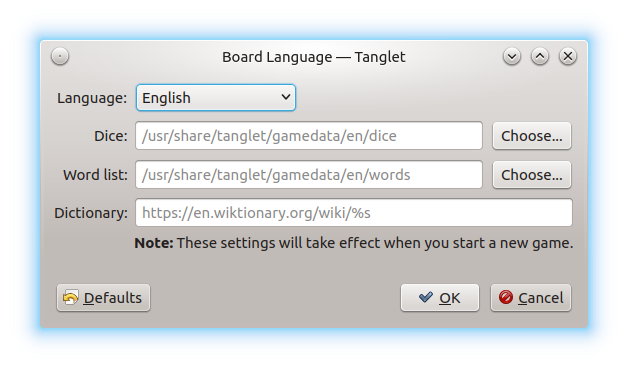

.. _configuration:

Game Configuration
******************

To configure **Tanglet**, open the **Settings** menu. You see the following
entries:

**Show Maximum Score** – you can choose between three options for the status
line at the bottom of the window:

* *Never* – You see word lengths and the count of words found for each length.

* *End Of Game* – At the end of the game, you see the contained words per word
  length and the count of words found by you.

* *Always*: The behavior described for *End Of Game* is always visible.

The visibility of the word count status bar can be toggled with
**Show Word Counts**.

**Show Missed Words** – In addition to the list of found words on the left, an
extra tab named **Missed** will de displayed. This tab is inactive until the
game ends.

**Board Language** – You can change the board language by clicking on the
drop-down list and choose from the available languages. Besides that, you have
some extra options:

You can change the file paths to *Dice*, *Word List* and *Dictionary* by
entering the file paths manually or click on the respective **Choose…** buttons
to open a file chooser dialog. To set all entries back to the defaults, click
on **Defaults** in the bottom left corner of the window. As usual, you can stop
editing the preferences with the **Cancel** button, and apply the changes with
**OK**. Your changes will be applied after the next start of **Tanglet**.

Under **Application Language**, you can change the language of the user
interface. The settings window opens with the button **<System language>**.
Click on it to change the desired language from the drop-down menu. Again, your
changes will be applied after the next start of **Tanglet**.

.. note::
     Maybe the following command is known to you for opening an application
     with different language settings:

     .. code-block::

        export LC_ALL=C && tanglet

     This doesn't work correctly in **Tanglet**. To change the user interface
     language, we recommend to use the configuration option described above.
