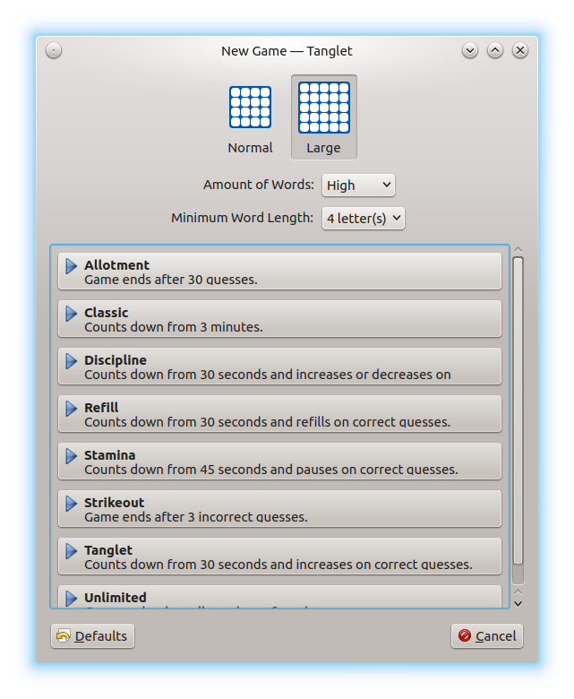

.. _introduction:

Introduction
************

:program:`Tanglet` is a single player word finding game based on
`Boggle <https://en.wikipedia.org/wiki/Boggle>`__. The object of the game is to
list as many words as you can before the time runs out. There are several timer
modes that determine how much time you start with, and if you get extra time
when you find a word.

You can join letters horizontally, vertically, or diagonally in any direction
to make a word, so as long as the letters are next to each other on the board.
However, you can not reuse the same letter cells in a single word. Also, each
word must be at least three letters on a normal board, and four letters on a
large board.

-----------------
Starting the game
-----------------

You can start the game using the application menu of your desktop environment.
Open the application menu and choose :menuselection:`Games --> Tanglet` or open
a quick start prompt using :kbd:`Alt-F2` and start typing *tanglet*, then click
on the application name found.

When :program:`Tanglet` starts, two board sizes are available, 4x4 and 5x5.
Click on one of them to apply. In the drop-down list right to
:guilabel:`Amount Of Words`, you can choose between more or less words
contained in the board. Try out how it results in the created word counts in
the board, in many cases, with a 5x5 board, you get more than 1000 contained
words. The other drop-down list :guilabel:`Minimum Word Length` lets you choose
between acceptable character counts. The minimally configurable word length
depends on the board let's say 5, then words with 4 letters, which actually
exists, won't be accepted by :program:`Tanglet`.

Finally you can choose between different game modes:

The following modes are available:

* :guilabel:`Allotment` – Game ends after 30 guesses.

* :guilabel:`Classic` – Counts fown from 3 minutes.

* :guilabel:`Discipline` – Counts down from 30 seconds and increases on correct
  guesses.

* :guilabel:`Refill` – Counts down from 30 seconds and refills on correct
  guesses.

* :guilabel:`Stamina` – Counts down from 45 seconds and pauses on correct
  guesses.

* :guilabel:`Strikeout` – Game ends after 3 incorrect guesses.

* :guilabel:`Tanglet` – Counts down from 30 seconds and increases or decreases
  on guesses.

* :guilabel:`Unlimited` – Game ends when all words are found.

-----------------
Menu bar overview
-----------------

*Game* menu
-----------

* :menuselection:`New &Game` – Starts a new game. If a previous game is still
  running, you will asked for confirmation to stop that game.

* :menuselection:`&New Roll` – Starts a new game in the same mode as the
  currently running one. Again, you will asked for confirmation to stop that
  game.

* :menuselection:`&Choose…` – Lets you start a game which has been saved
  previously. A file chooser dialog will be opened where you can search for the
  desired game file.

* :menuselection:`&Share` – Lets you save the game in a file. A file chooser
  dialog will be opened where you can choose for a file name and directory.
  Although it is possible, keep the :guilabel:`File type` entry unchanged. We
  don't recommend to save files with another extension than :file:`.tanglet`.

* :menuselection:`&End` – End the game. You will asked for confirmation to stop
  the game.

* :menuselection:`&Pause` – Pause the game. Probably you need this for
  time-limited games. When pausing a game, the whole window content disappears.
  After clicking anywhere in the window, the pause ends and the content comes
  back. Note, also when the window losts the focus, the window content
  disappears.

* :menuselection:`&Details` – Shows details about the running game, such as the
  board size, the word density and length, the game type and a short
  description of that game.

* :menuselection:`&High Scores` – Shows the High Scores. The initial view shows
  the High Scores for the type of the currently running game. To view the High
  Scores for the other game types, click on the vertical tab bar on the left.

* :menuselection:`&Quit` – Quits the game and the application.

*Settings* menu
---------------

See :ref:`configuration` about how to use the entries of the
:menuselection:`&Settings` menu.

*Help* menu
-----------

* :menuselection:`&Controls` – Shows a brief summary of the usage. In fact,
  the same as described in :ref:`howtoplay`.

.. For the upcoming user manual; mnemonic needs to be added later

* :menuselection:`User &manual` – Opens this user manual in your configured
  standard browser. The opened application is out of the scope of
  :program:`Tanglet`; if you like to use a different browser or HTML viewer,
  you need to configure this in the settings of your desktop environment.

* :menuselection:`&About` – Shows a brief summary, including the version number
  of :program:`Tanglet`.

* :menuselection:`About &Qt` – Shows a description of
  `Qt <https://www.qt.io/>`__, which is the code base of :program:`Tanglet`.
